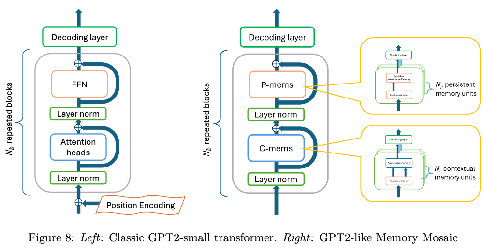

# nanoMosaics

This repo implements MemoryMosaics by minimally modifying nanoGPT
(original repo [here](https://github.com/karpathy/nanoGPT)).

**License**: The original nanoGPT code comes under the MIT License, but our changes come under the [Apache-2.0 License](../LICENSE.txt).

| File | Content |
| ---- | ------- |
| [`LICENSE-nanoGPT`](LICENSE-nanoGPT) | Copy of the original nanoGPT `LICENSE` file |
| [`README-nanoGPT.md`](README-nanoGPT.md) | Copy of the original nanoGPT `README.md` file |
| [`gpt_model.py`](gpt_model.py) | Copy of the original nanoGPT `model.py` file |
| [`mosaic_model.py`](mosaic_model.py) | Menory mosaic architecture (see notes below) |
| [`train.py`](train.py) | Configurable train program (see notes below) |

File `mosaic_model.py` contains a full implementation of the MemoryMosaic architecture.
Compare with file `gpt_model.py` which contains the original nanoGPT GPT2 architecture.
The `PersistentMem` and `ContextMem` classes defined in `mosaic_model.py`
are drop-in replacements for the `MLP` and `CausalSelfAttention` classes
of `gpt_model.py`.

There are minimal changes in `train.py` to use the MemoryMosaic model,
including new configurable parameters:
- `model_type in ['gpt', 'mosaic']`
- `pmem_size`: Number of Key-Value pairs in the Persistent Memory
- `pmem_count`: Number of Persistent Memories (per head)

For comparison of GPT and MM, the `pmem` parameters should be adjusted
such that the number of parameters is roughly the same. For
(multi-gpu) setup and training, refer to [`README-nanoGPT.md`](README-nanoGPT.md).

Due to increased memory requirements with persistent memory,
you might want to adjust batch size if training mosaics via
`config/train_gpt2.py`. Alternatively you can replace the `PersistentMem`
instances by `MLP` instances without substantial impact on
the performance.

